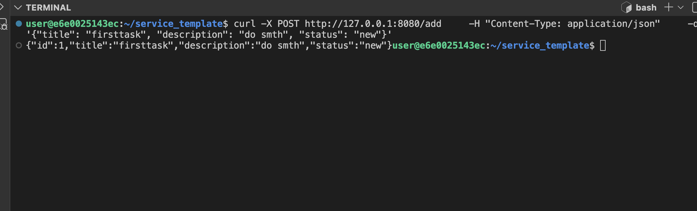
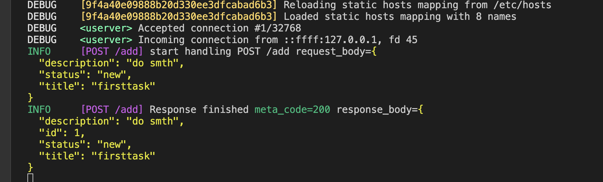
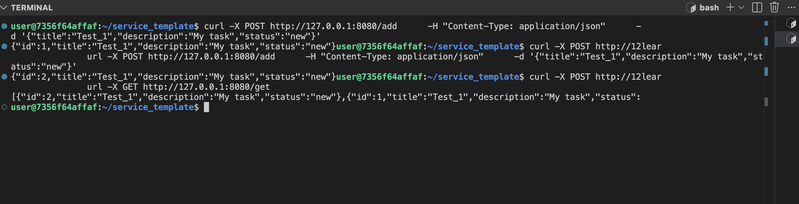
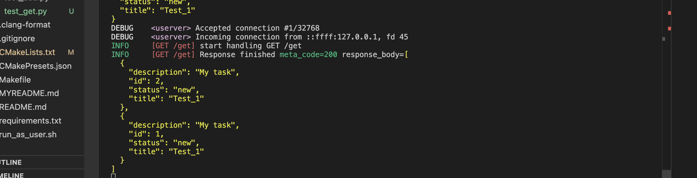

# Task Tracker Service

Простой сервис для управления задачами (task tracker) на C++ с использованием **userver**.

## Содержание

- [Описание](#описание)
- [Установка Userver](#установка-userver)
- [Сборка и запуск](#сборка-и-запуск)
- [API](#api)

---

## Описание

Сервис реализует управление задачами с базовыми операциями:  
- Добавление новой задачи (`/add`)  
- Остальное в процессе  

Используется **userver** — асинхронный C++ фреймворк для создания веб-сервисов.

---

## Установка Userver

Выбираем нужный шаблон:  

- [service_template](https://github.com/userver-framework/service_template) — HTTP  
- [task-tracker-without-bd](https://github.com/userver-framework/task-tracker-without-bd) — HTTP + PostgreSQL  
- [pg_grpc_service_template](https://github.com/userver-framework/pg_grpc_service_template) — HTTP + PostgreSQL + gRPC  
- [mongo_grpc_service_template](https://github.com/userver-framework/mongo_grpc_service_template) — HTTP + MongoDB + gRPC  

Клонируем репозиторий:

```bash
git clone https://github.com/your-username/your-service.git && cd your-service
```

Заменить все service_template(для masOS):

```bash
brew install gnu-sed

find . -not -path "./third_party/" -not -path ".git/" -not -path './build_*' -type f | xargs gsed -i 's/task-tracker-without-bd/YOUR_SERVICE_NAME/g'

```
Открыть в vscode, он предложит переоткрыть c конфигурацией проекта.   

## Сборка и запуск

```bash
userver-create-service [--grpc] [--mongo] [--postgresql] myservice


```

Перед сборкой:

```bash
export USERVER_ENABLE_STACK_USAGE_MONITOR=0
```

## API
**POST /add**
Добавляет новую задачу.  
Request JSON:  
```bash
{
    "title": "Название задачи",
    "description": "Описание задачи",
    "status": "new"
}
```   
```bash
Response JSON:
{
    "id": 1,
    "title": "Название задачи",
    "description": "Описание задачи",
    "status": "new"
}
```

  



**POST /get**

Возвращает все задачи в формате json

Request JSON:  
```bash
{
    "description": "My task",
    "status": "new",
    "title": "Test_1"
}
```   

```bash
Response JSON: [
{
    "description": "My task",
    "id": 2,
    "status": "new",
    "title": "Test_1"
}

  {
    "description": "My task",
    "id": 1,
    "status": "new",
    "title": "Test_1"
  }
]

  




```


```bash
Response JSON:
{
    "id": 2,
    "description": "My task",
    "status": "new",
    "title": "Test_1"
}
```
  


**Ошибки:**  
400 Bad Request — если поля отсутствуют или json некорректен.   